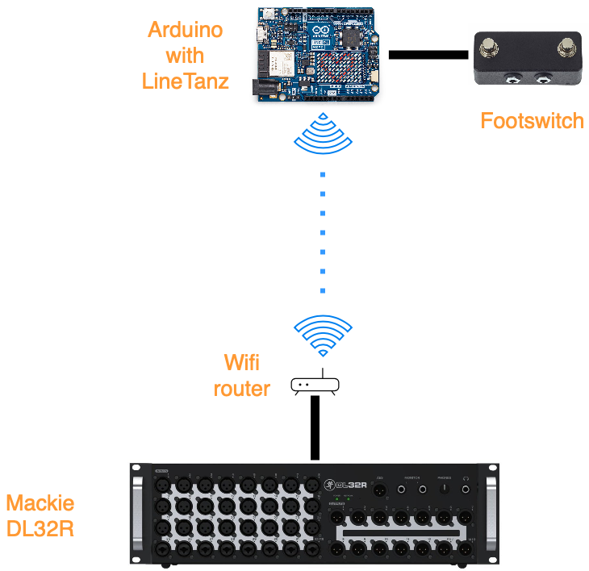

# LineTanz

A hardware bridge for adding physical controllers to the Mackie DL series audio mixer.

## Working Principle

## Background

I have a Mackie DL32R mixer, which I use with my band. The DL mixers are controlled purely via the Master Fader app on a device, in my case an Apple iPad. This is great, so far. But as a musician with no sound engineer except myself, some simple things need to be taken care of. One is to mute the vocal effects (reverb, delay etc) in between songs. Many other mixers have a footswith jack where an external controller can be connected to solve this requirement, but the DL32R does not. This project solves that.